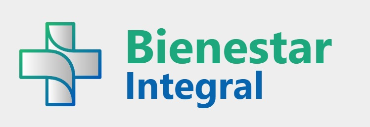

  <h1 align="center">
     
     
    
  </h1>

<h1 align="center"> Tecnicatura Universitaria en Desarrollo Web </h1>

<h2 align="center"> Cátedra: Introducción al Desarrollo Web </h1>

<h2 align="center"> Trabajo Final Integrador - Grupo: IDW_08 </h2>

> [!IMPORTANT]
**Estado: Primera Entrega - 9 de Septiembre 2025**

## 👨‍💻 **Integrantes Grupo: IDW_08**

<table width="100%">
<tbody>
<tr>
<td align="center">
<h3>Ariel Levita</h3>
 
<a href="https://github.com/arielLevita">@arielLevita</a>
</td>
<td align="center">
<h3>Elisa Beltramone</h3>
 
<a href="https://github.com/Elisa-Beltramone">@Elisa-Beltramone</a>
</td>
<td align="center">
<h3>Gabriel Osvaldo Roman</h3>
 
<a href="https://github.com/GabrielORoman">@GabrielORoman</a>
</td>
</tr>
<tr>
<td align="center">
<h3>María Olivares</h3>
 
<a href="https://github.com/MaryOlivares">@MaryOlivares</a>
</td>
<td align="center">
<h3>Nerina Bonnin</h3>
 
<a href="https://github.com/NerinaBonnin">@NerinaBonnin</a>
</td>
<td align="center">
<h3>Walter Cuesta</h3>
 
<a href="https://github.com/wox9000">@wox9000</a>
</td>
</tr>
</tbody>
</table>

---

---

# Bienestar Integral | Clínica

## Tecnologías Utilizadas

- **HTML:** Para estructurar el contenido de las páginas.
- **CSS:** Para definir estilos y conectar con los documentos HTML.

---

  <h3>Estadísticas del Repositorio</h3>
   
  

---

## Enlaces del Proyecto

- **Repositorio GitHub:** [[https://github.com/arielLevita/IDW_08](https://github.com/arielLevita/IDW_08)]

---
> [!NOTE]
> Este es un trabajo en proceso.
---
